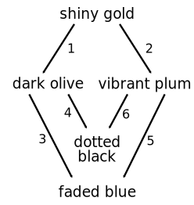
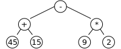

# gstd

⚠ This project is in very early development. Many of these features are not yet implemented. And the ones that are, aren't implemented particularly well. ⚠

**gstd** is a standard library / interface for conveniently working with node graphs. Inspired by things like the in-built `Array` constructor for dealing with arrays and lodash, `gstd.Graph` aims to provide similar, functional programming inspired interfaces for working with graphs.

### Motivation

Graphs are a powerful abstract data type for a wide variety of problem spaces. However few languages provide in-built support for manipulating and storing data in graphs like they do for arrays, lists, sets, or even trees. Unlike arrays and lists, graphs are inherently two-dimensional -- this makes them difficult to visualize. What if working with graphs was as easy as working with arrays? What if all the interfaces and functions you were used to using on lists and arrays were also available? What if you could easily print a graph as well for simple debugging? Answering these questions is the aim of `gstd`.


## Documentation

### Status

- ✅ Creating a graph from nodes and edges
- ✅ Creating a graph from only edges
- [ ] `.log()` in terminal
- ✅ `.log()` in browser console
- ✅ `.slice()`
- ✅ `.reduce()`
- [ ] `.reduceReverse()`
- ✅ `.reverse()`
- ✅ `.forEach()` Implementation with no options
- [ ] `.map()`
- ✅ Math tree example
- ✅ AoC reduce example
- [ ] State machine example

### Installation

```sh
npm install gstd
```

And then in your code:

```js
import { Graph } from 'gstd';
```

Or via a CDN:

```html
<script type="module">
   import { Graph } from 'https://unpkg.com/gstd?module';
</script>
```

### Creating a graph

Creating a graph is as simple as:

```js
const graph = new Graph({
    edges: [
        ['A', 'B'],
        ['B', 'C'],
        ['A', 'C'],
    ]
});
```

But understanding this graph from the data format above is complicated — so let's view it in a more two dimensional format, using `graph.log()`.

### Logging in a terminal (TODO)

In a terminal environment, where images are unsupported, the graph is displayed using ascii art:

```
        ┌───┐
        │ A ├───┐
        └─┬─┘   │
          │     │
          ▼     │
        ┌─┴─┐   │
        │ B │   │
        └─┬─┘   │
          │     │
          ▼     │
        ┌─┴─┐   │
        │ C │◄──┘
        └───┘
```

And there are plenty of options:

`graph.log({ boxes: false })`


```
          A ──┐
          │   │
          ▼   │
          B   │
          │   │
          ▼   │
          C ◄─┘
```


`graph.log({ boxes: false, orientation: horizontal })`

```
A ──► B ──► C
│           ▲
└───────────┘
```

`graph.log({ boxes: false, diagonals: true })`

```
    A
  ╱   ╲
 ▼     ╲
 B      ╲
  ╲      ▼
    ───► C
```

### Logging in browser console

The browser console supports svg! So we can log much better graphics there with `graph.log()`


## Examples

### Demonstrative, toy example

The problem that inspired this project was a question from Advent of Code 2020. In it, you are given the following rules:

```
light red bags contain 1 bright white bag, 2 muted yellow bags.
dark orange bags contain 3 bright white bags, 4 muted yellow bags.
bright white bags contain 1 shiny gold bag.
muted yellow bags contain 2 shiny gold bags, 9 faded blue bags.
shiny gold bags contain 1 dark olive bag, 2 vibrant plum bags.
dark olive bags contain 3 faded blue bags, 4 dotted black bags.
vibrant plum bags contain 5 faded blue bags, 6 dotted black bags.
faded blue bags contain no other bags.
dotted black bags contain no other bags.
```

Let's say we wanted to determine the total number of bags you would be holding, if you were holding a **shiny gold bag**.

Representing this as a `gstd.Graph`, we have:

```js
const graph = new Graph({
   edges: [
      ['light red', 'bright white', {count: 1}],
      ['light red', 'muted yellow', {count: 2}],
      ['dark orange', 'bright white', {count: 3}],
      ['dark orange', 'muted yellow', {count: 4}],
      ['bright white', 'shiny gold', {count: 1}],
      ['muted yellow', 'shiny gold', {count: 2}],
      ['muted yellow', 'faded blue', {count: 9}],
      ['shiny gold', 'dark olive', {count: 1}],
      ['shiny gold', 'vibrant plum', {count: 2}],
      ['dark olive', 'faded blue', {count: 3}],
      ['dark olive', 'dotted black', {count: 4}],
      ['vibrant plum', 'faded blue', {count: 5}],
      ['vibrant plum', 'dotted black', {count: 6}],
   ],
});

graph.log();
```


Since we're only interested in the shiny gold node and its descendants, let's `slice` the graph:

```js
graph.slice('shiny gold').log();
```



Just like e.g. `['a', 'b', 'c'].slice(1)` returns a new `Array` from `b` to the end, `graph.slice('shiny gold')` returns a new graph, that contains the `shiny gold` node and any downstream nodes and edges.

If we were working with an array, we would likely use something like `reduce` to aggregate down to a single number. With `gstd.Graph`, we use... `reduce`! But unlike arrays, we have two types of elements: nodes and edges. We can reduce over either or both.

```js
graph
   .slice('shiny gold')
   .reduceReverse({
      nodes: (accInEdges, curNode) => 1 + _.sum(accInEdges),
      edges: (accNode, curEdge) => curEdge.count * accNode,
   });
```

And that's it! That returns the correct value. But what did we do exactly? Like `reduce` for arrays, this code can look a little cryptic the first time you see it.

The end goal of a `reduce` operation like this is to end up with a single value. So we need to convert every element (every node and every edge) of the graph into a number and then combine those numbers somehow. The `nodes` function is given the computed values of the downstream edges, and the node itself to determine what value the current node should get. The `edges` function does the same for edges. It is given the computed value of the node it points to and the current edge to determine the value.

Note we begin at the node which has no children, since we are reducing in `reverse` order with `reduceReverse` (analogous to `reduceRight` for arrays). We do this because in order to determine the value of a node, the values of all downstream nodes to already be computed. Here's a step-by-step of the computations performed:

| Index | Function called                             | Computed Value | Notes                                                                |
| ----- | ------------------------------------------- | -------------- | ------                                                               |
| 0     | `nodes([], faded_blue)`               | 1              | The node has no downstream edges, so computation begins here.               |
| 1     | `nodes([], dotted_black)`             | 1              | This node also has no downstream edges. |
| 2     | `edges(1, dark_olive→faded_blue)`   | 3              | This edge's downstream node has already been computed, so its value can now be computed. We multiply the `count` of the edge with the node it's connected to. |
| 3     | `edges(1, dark_olive→dotted_black)` | 4              |  |
| 4     | `nodes([3, 4], dark_olive)`           | 8              | Now that all its down stream elements have been reduced to a number, we can determine the value of `dark olive`. |

<p align="center">
⋮
</p>

And so on, until the value of `shiny gold` is reduced to 33.

### Reduce Trees

Trees can be seen as a type of graph, so let's try reducing a simple parse of the mathematical expression `45 + 15 - 9 * 2`.

```js
const graph = gstd.treeToGraph({
   tree: {
      value: '-',
      children: [
         {
            value: '+'
            children: [
               { value: 45 },
               { value: 15 },
            ]
         },
         {
            value: '*'
            children: [
               { value: 9 },
               { value: 2 },
            ]
         },
      ]
   }
});
graph.log();
```



To determine the value of the formula, we can simply reduce once more:

```js
graph.reduceReverse({
   nodes: ([accLeft, accRight], node) =>
      node.value == '-' ? accLeft - accRight :
      node.value == '+' ? accLeft + accRight :
      node.value == '*' ? accLeft * accRight :
      node.value == '/' ? accLeft / accRight :
      node.value,
});
```

And you get that the value is, of course, 42.

Note how in this example, we don't specify an `edges` reduction function since it is not necessary.


### Auto-moving search

Here we use `gstd.Graph` to define a state machine for a robot looking for a key on a 10x10 grid.

```js
const startState = {
   position: [1, 1],
   direction: 'E',
   grid: `
      🔳🔳🔳🔳🔳🔳🔳🔳🔳🔳      
      🔳🔽⬜⬜⬜⬜⬜⬜⬜🔳
      🔳❎⬜⬜⬜⬜⬜⬜⬜🔳
      🔳❎⬜⬜⬜⬜⬜⬜⬜🔳
      🔳❎⬜⬜⬜⬜⬜⬜⬜🔳
      🔳❎❎❎❎🔳🔳🔳🔳🔳
      🔳🔳🔳🔳❎⬜⬜⬜⬜🔳
      🔳❎❎🔴❎⬜⬜🔑⬜🔳
      🔳❎❎❎❎⬜⬜⬜⬜🔳
      🔳🔳🔳🔳🔳🔳🔳🔳🔳🔳
   `.trim().split('\n').map(row => Array.from(row.trim()));
};
const directions = ['N', 'E', 'S', 'W'];

function getNextPosition(x, y, direction) {
   return (
      direction == 'N' ? [x    , y - 1] :
      direction == 'E' ? [x + 1, y    ] :
      direction == 'S' ? [x    , y + 1] :
      direction == 'W' ? [x - 1, y    ] :
      null
   );
}

function getNextTile({position: [x, y], direction, grid}) {
   const [nextX, nextY] = getNextPosition(x, y, direction);
   return grid[nextY][nextX];
}

const stateMachine = new gstd.Graph({
   nodes: {
      step: (state) => {
         // Mark current spot as already seen
         state.grid[state.position[1]][state.position[0]] = '*';
         state.position = getNextPosition(...state.position, direction);
      },

      'turn cw': (state) => {
         state.direction = directions[
            (directions.indexOf(state.direction) + 1) % directions.length
         ];
      }
   }
   edges: [
      ['look', 'has obstacle', {test: (state) => getNextTile(state) == '🔳'}],
      ['look', 'path is clear', {test: (state) => getNextTile(state) == '⬜'}],
      ['look', 'already visited', {test: (state) => getNextTile(state) == '*'}],
      ['look', 'found key!', {test: (state) => getNextTile(state) == '🔑'}],

      ['path is clear', 'step']
      ['has obstacle', 'turn cw'],
      ['already visited', 'turn cw'],

      ['turn cw', 'look'],
      ['step', 'look'],
   ]
});

stateMachine.forEach({
   startNode: 'look',
   initialValue: startState,
   transition: (state, node) => node(state)
})
```
